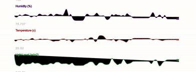
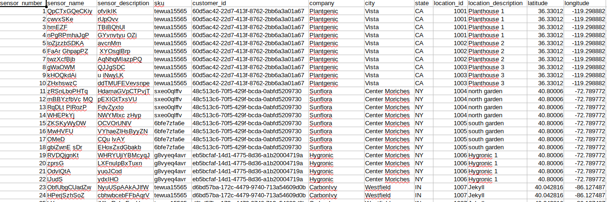
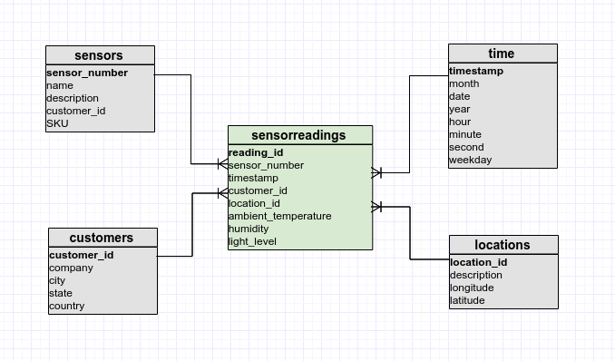
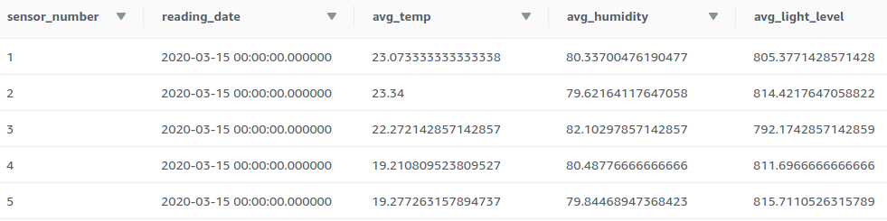
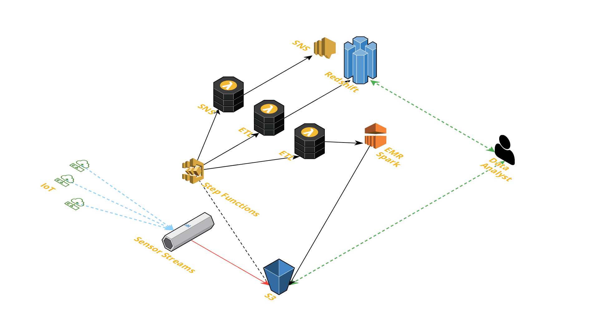
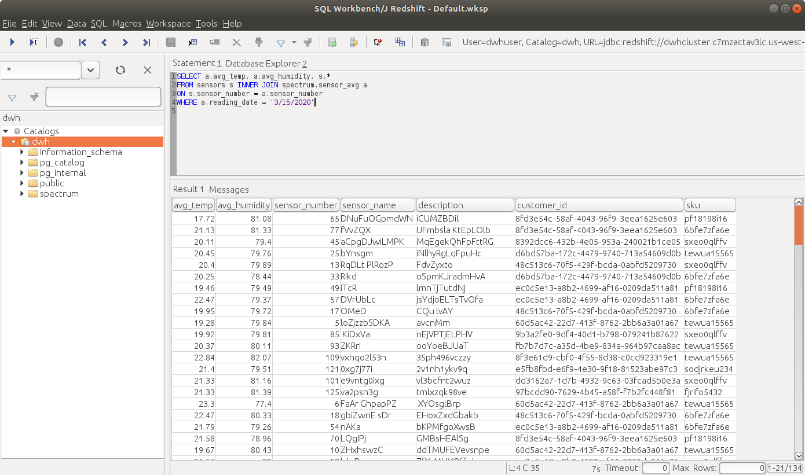

<p align="center">
    
</p>

## <p align="center">Wireless Sensor Network Solutions for Precision Management of Regulated Climatic Growing Conditions</p>
### <p align="center">Data Warehouse and Data Lake ETL pipelines </p>

# Background
FloraSense&trade; is a provider of wireless sensor network (WSN) solutions for companies that operate one or more structures (greenhouses) in which plants requiring regulated climatic conditions are grown.  A greenhouse can have one or more sensors deployed with each sensor monitoring the proximate ambient temperature, humidity and light level and transmitting this data through the network. This streaming data can be ingested for real-time anaytics as well as processed and stored for batch analysis and reporting. 

## Analytics Requirements

The anaytics team at FloraSense needs to perform analysis on recorded sensor data, including per device metrics, for devices grouped by customer and location, and over various time periods.  Performing ETL to expose a dimensional data model should allow analysts to execute queries to meet these needs.  However, requirements also include the ability to analyze aggregated metrics on a per sensor basis such as average daily temperature and humidity.  Rather than having to repeatedly calculate these values, which analysts have found to be very difficult and time consuming, they've asked if a workflow could perform these computations and make the results queryable by device.  

The high-level steps to meet the analysts' requirements are:

1. Capture raw streaming sensor data and write to files in S3.
2. Perform one or more ETL workloads to process and store the data. 
3. Enable repetition of workflows for new data streams without duplicate processing of data.

# Solution Story

## From dynamic environment conditions to actionable data

1. A WSN emits streams of sensor readings that are captured by a [custom real-time stream processing application](https://github.com/mikeacosta/florasense/tree/master/stream-processor) and processed using the [Amazon Kinesis](https://aws.amazon.com/kinesis/) Data Streams service.

<p align="center">
    
</p>

<p align="center">
    
</p>

2. Streaming sensor data is stored in [Amazon S3](https://aws.amazon.com/s3/) along with sensor sales data and customer data from the company's CRM and order fulfillment systems.

    ## Sensor readings dataset

    Raw sensor readings are collected and saved as JSON files in S3 partitioned by date and time written, and each file includes between 2500 and 3000 rows of emitted sensor readings.  Below is an example of two files in the dataset.
    ```
    2020/03/10/16/sensor-network-1-2020-03-10-16-19-23-3a4afd23-2aba-4a87-b36f-741d1dec62d6.json
    2020/03/10/16/sensor-network-1-2020-03-10-16-14-22-e80d20ed-881e-498a-9431-6e08e26ad186.json
    ```
    Each row includes the measured condtions by a given sensor at a point in time.  Below is an example of several rows in a single JSON file.
    ```json
    {"ambient_temperature":"20.76","timestamp":1583856846,"photosensor":"889.80","humidity":"80.0260","sensor_number":79,"reading_id":"probe-b6cc35ed-79474"}
    {"ambient_temperature":"17.30","timestamp":1583856847,"photosensor":"806.70","humidity":"79.7698","sensor_number":68,"reading_id":"probe-f8dce881-68319"}
    {"ambient_temperature":"24.78","timestamp":1583856847,"photosensor":"777.10","humidity":"79.9419","sensor_number":70,"reading_id":"probe-5ba1ed86-70953"}
    {"ambient_temperature":"18.40","timestamp":1583856847,"photosensor":"812.72","humidity":"77.1340","sensor_number":109,"reading_id":"probe-0601bc68-109125"}
    {"ambient_temperature":"23.96","timestamp":1583856847,"photosensor":"819.77","humidity":"77.2508","sensor_number":44,"reading_id":"probe-730696c5-44502"}
    {"ambient_temperature":"29.12","timestamp":1583856847,"photosensor":"763.19","humidity":"77.0638","sensor_number":9,"reading_id":"probe-e5af654f-9198"}
    ```

    ## Sales report sensor data

    This dataset is a CSV file consisting of records representing each sensor sold and deployed to a customer location.  Below is an example of data in this file including the header row.

    <p align="center">
        
    </p>

    ## CRM customer dataset

    Each JSON file in this dataset contains customer metadata, and the files are partitioned by the first letter in the customer's name.  Each filename is the [UUID](https://en.wikipedia.org/wiki/Universally_unique_identifier) assigned to that customer.

    ```
    customer_data/b/e5fb8fbd-e6f9-4e30-9f18-81523abe97c3.json
    customer_data/c/d6bd57ba-172c-4479-9740-713a54609d0b.json
    ```
    Customer data example
    ```json
    {"customer_id": "e5fb8fbd-e6f9-4e30-9f18-81523abe97c3", "company": "Botanium", "city": "Fort Worth", "state": "TX"}
    ```

3. An ETL process is periodcally run that populates an [Amazon Redshift](https://aws.amazon.com/redshift/) data warehouse for querying and other analytics workloads.  The data is initially loaded into three staging tables consisiting of raw sensor readings, individual sensor data and customer data.  From the staging tables, the data is transformed into a set of [fact and dimension tables](https://en.wikipedia.org/wiki/Star_schema) in Amazon Redshift.  This schema is illustrated below.

    <p align="center">
        
    </p>

4. An additional [Apache Spark](https://spark.apache.org/) workload against the same dataset is executed on an [Amazon EMR](https://aws.amazon.com/emr/) cluster.  This job computes average daily metrics per sensor and writes this data to [Parquet](https://parquet.apache.org/) files stored in a data lake in S3.  Below is a sample of results from querying the data in S3 which includes columns for the calculated average daily temperature, humidity and light level for each sensor.

<p align="center">
    
</p>

## Workflow Orchestration

Sequential execution of various workflow components is coordinated using [AWS Step Functions](https://aws.amazon.com/step-functions/).

The code to perform each workflow step is deployed as a [Lambda function](https://aws.amazon.com/lambda/), and the Step Functions [State Machine](https://docs.aws.amazon.com/step-functions/latest/dg/amazon-states-language-state-machine-structure.html) for this workflow executes each Lambda function in a designated order.

An exception to this is the Spark workload.  Step Functions supports EMR integration, including the ability to instruct a cluster to perform a unit of work, such as a Spark job in this case. 

<p align="center">
    
</p>

- `Publish to SNS topic` - Publish a message to an [Amazon SNS](https://aws.amazon.com/sns) topic which will be pushed to subscribers.  The message in this case would be "Step function is starting execution."

- `Run data warehouse ETL` - Run the ETL workflow that processes data in S3 and imports into Redshift.

- `Perform data quality checks` - Various quality checks are performed on the staging and transformed data.  An SNS message is published if any anomalies exist.

- `Enable JSON files for Spark job` - Processed sensor reading files are made available for the Spark job in the next step.

- `Run Spark job on EMR` - Add an EMR step to an existing cluster for executing this workload.

- `Bookmark JSON files as processed` - Prevents any sensor reading files processed in this workflow execution from future duplicate processing.

- `Publish to SNS topic` - Publish an "Execution complete" message.

## Addressing Other Scenarios
### The data is increased by 100%.
    
- Increase Redshift ETL Lambda function timeout and allocated CPU settings
- Redshift offers node types to meet higher disk space requirements
- EMR autoscaling can be configured to handle increased data
- Concurrent workflows can be executed to handle data volume increases

### The pipelines would be run on a daily basis by 7 am every day.
- The workflow has been designed to handle reptition without duplicate processing of data
- Step Functions State Machine can easily be scheduled for execution triggered by various events including time of day
- State Machine can be modified to include steps for creating and terminating an EMR cluster, improving workflow automation

### The database needed to be accessed by 100+ people.
- Redshift supports concurrency scaling for added query processing power on an as-needed basis
- For predicable scaling needs, cluster overprovisioning and optimazation are feasible options

## Architecure

Tying everything together, this diagram illustrates a high-level overview of the major components of the workflow architecture.

<p align="center">
    
</p>

# Data Analysis

### Querying results in a Data Warehouse and Data Lake together

Although the workloads have delivered data in different storage solutions, [Amazon Redshift Spectrum](https://docs.aws.amazon.com/redshift/latest/dg/c-using-spectrum.html) provides a mechanism for querying the data together.

By defining a schema for the parquet files in S3 and registering this as a table in an external data catalog such as [Apache Hive](https://hive.apache.org/), this Redshift Spectrum table can be queried and joined with tables in Redshift, either using the online Query Editor in the AWS console or an external tool such as [SQL Workbench](https://www.sql-workbench.eu/).

This image displays the results of SQL that joins the `sensors` table in Redshift and the external Redshift Spectrum table `spectrum.sensors_avg` on the `sensor_number` column in each table.

<p align="center">
    
</p>

This allows analysts to associate average daily sensor measurements with other sensor details such as sensor name, customer and sensor location.

# Other Stuff

## Prerequisites
In addition to ingesting streaming sensor data as described above, the following prerequisites must be satisfied prior to workflow execution.

1. an available Redshift cluster
2. tables created in Redshift (by executing queries in `create_tables.py`)
3. a running EMR cluster 

## Project files

- `stream-processor/` - Java stream processing application

- `kinesis-infrastructure/` - [AWS CloudFormation](https://aws.amazon.com/cloudformation/) templates for provisioning Kinesis resources

- `etl/redshift_cluster.ipynb` - [Jupyter Notebook](https://jupyter.org/) for creating Redshift cluster

- `etl/sql_queries.py` - queries for creating tables and transforming data

- `etl/create_tables.py` - drops and creates tables in Redshift

- `etl/dwh.cfg` - configuration values for AWS services

- `etl/spark_etl.py` - code for Spark workload on EMR

- `etl/lambda_*.py` - Lambda functions for Redshift ETL and other Step Functions 

- `etl/sensor_parquet.sql` - SQL to enable querying parquet files in S3

## Resources

- [PubNub Sensor Network](https://www.pubnub.com/developers/realtime-data-streams/sensor-network/)

<p align="center">
    <br />
    <sub>&copy; 2020 FloraSense</sub>
</p>